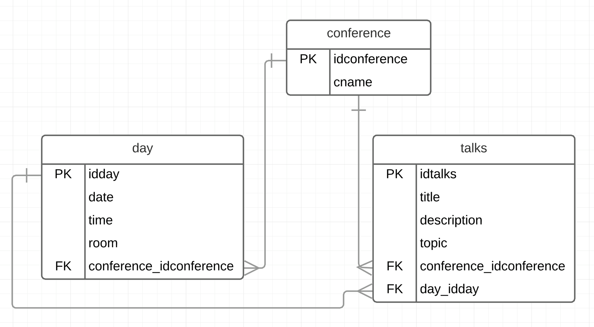

## PGR200 Innlevering 2: JDBC og databaser

###Deltakere
Nicolai Vatne & Alexander Gustavsen  
NickVatne & alexandergustavsen  (@GitHub)
vatnic17 & gusale17   (@Feide)

### Kjøring

```
Programmet:
Prinsippet bak applikasjonen vår er at du kjører "databaseMain.java" inn i konsollen.
1. Du vil få 3 valg som er "Show, Add, Clear".
2. Etter hver user input kjører du "menu for å komme tilbake til hovedmenyen"
3. Muligheten etter det er litt selvforklarlige.


bash
> mvn test
> mvn package
> oppdater datasource.properties med database settings
> java -jar target/innlevering-2-jdbc-Nickvatne.jar show
> java -jar target/innlevering-2-jdbc-Nickvatne.jar add
> java -jar target/innlevering-2-jdbc-Nickvatne.jar clear
```


### Datamodell



### Link til video
https://www.youtube.com/watch?v=9UEs4b3c9xI


### Sjekkliste for innleveringen

- [X] Kodekvalitet
    - [X] Produserer `mvn package` en executable jar? (tips: Bruk `maven-shade-plugin`)
    - [X] Bruker koden Java 8 og UTF-8
    - [X] Bygger prosjektet på https://travis-ci.com?
    - [X] Har du god test-dekning? (tips: Sett opp jacoco-maven-plugin til å kreve at minst 65% av linjene har testdekning)
    - [X] Kobler main-klassen seg opp mot PostgreSQL ved hjelp av en properties-fil?
    - [X] Kan main-klassen resette databasen? (tips: Bruk Flyway#clear)
- [X] Funksjonalitet
    - [X] Kan man legge inn et nytt foredrag?
    - [X] Kan man liste foredrag i databasen?
    - [ ] Valgfritt: Oppretter main-klassen et konferanseprogram med flere dager og tracks?
    - [ ] Valgfritt: Kan main-klassen vise konferanseprogrammet?
- [ ] Dokumentasjon i form av README.md
    - [X] Navn og Feide-ID på dere de som var på teamet
    - [X] Inkluderer dokumentasjonen hvordan man tester ut funksjonaliteten programmet manuelt? (Inkludert eventuell ekstra funksjonalitet dere har tatt med)
    - [X] Inkluderer dokumentasjonen en evaluering av hvordan man jobbet sammen?
    - [X] Inkluderer dokumentasjonen en screencast av en parprogrammeringsesjon?
    - [X] Inkluderer dokumentasjonen en evaluering _fra_ en annen gruppe og en evaluering _til_ en annen gruppe?
    - [X] Inkluderer dokumentasjonen et databasediagram
    - [X] Inkluderer dokumentasjonen en link til screencast av programmeringsesjon?
